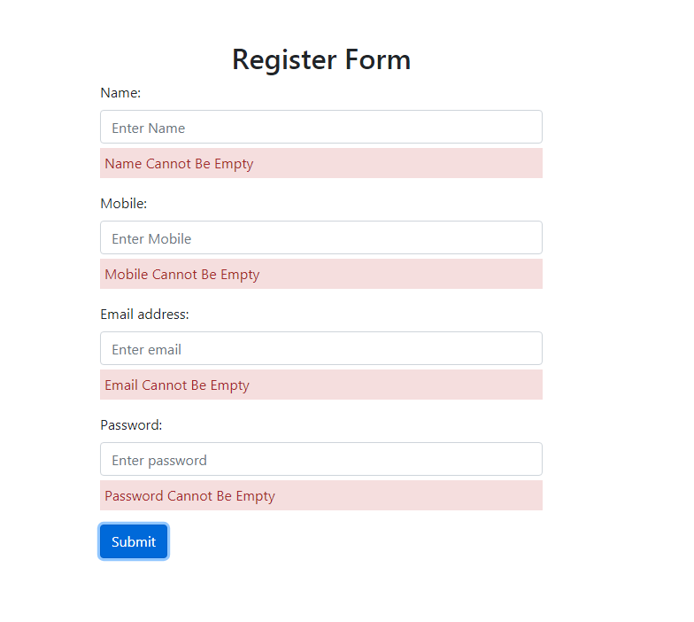

# Form validation using Object Oriented Programming



Implement using Classes like Validator, FormGroup, Form. We can use this reusable code for many forms.
Only the bellow code is required to call the Form reusable code.

```
const form = new Form('registerForm');
form.createFormGroups([
    new FormGroup('name', [Validator.REQUIRED, Validator.MINVALUE, Validator.setMinCharaters(2), Validator.STRING_FORMAT]),
    new FormGroup('mobile', [Validator.REQUIRED, Validator.NUMBER_FORMAT]),
    new FormGroup('email', [Validator.REQUIRED, Validator.EMAIL_FORMAT]),
    new FormGroup('password', [Validator.REQUIRED])
]);
```

###  JavaScript Static methods & properties
Static methods are associated with a class, not the instances of that class. Thus, static methods are useful for defining helper or utility methods.
Usually, static methods are used to implement functions that belong to the class, but not to any particular object of it.
we can access the property and method directly using the class name.


To invoke the static method, you use the following syntax:
Validator is a class and createValidations is static method which you can directly access using the class.
```
Validator.createValidations(formGroup);
```

Static properties
```
class Validator{
    static REQUIRED = 'REQUIRED';
    static MINVALUE = 'MINVALUE';    
    static STRING_FORMAT = 'STRING_FORMAT';
    static NUMBER_FORMAT = 'NUMBER_FORMAT'; 
    static EMAIL_FORMAT = 'EMAIL_FORMAT';
    static minCharacters = 0;

    static setMinCharaters(val) {
        this.minCharacters = val;
        return this.minCharacters;
    }

    // To call the static method we do not need to create an instance or object of the class
    static createValidations(formGroup) {
        formGroup.validations.forEach(validator => {
            if(validator === this.REQUIRED) {
                if(formGroup.value === '' ) {
                    formGroup.addError({
                        field: formGroup.id,
                        message: `${formGroup.id} cannot be empty`
                    });
                }                
            }
            if(validator === this.MINVALUE) {
                if(formGroup.value.split('').length < this.minCharacters ) {
                    formGroup.addError({
                        field: formGroup.id,
                        message: `${formGroup.id} needs minimum ${this.minCharacters} characters`
                    });
                }                
            }
            if(validator === this.STRING_FORMAT) {
                let regx = /^[a-zA-Z ]{0,30}$/ ;
                if(formGroup.value !== '' && !regx.test(formGroup.value)) {
                    formGroup.addError({
                        field: formGroup.id,
                        message: `${formGroup.id} should be valid string and maximum 30 characters allowed`,
                    });
                }
            }
            if(validator === this.NUMBER_FORMAT) {
                let regx = /^\d{10}$/ ;
                if(formGroup.value !== '' && !regx.test(formGroup.value)) {
                    formGroup.addError({
                        field: formGroup.id,
                        message: `${formGroup.id} should be valid number`,
                    });
                }
            }
            if(validator === this.EMAIL_FORMAT) {
                let regx = /\S+@\S+\.\S+/;
                if(formGroup.value !== '' && !regx.test(formGroup.value)) {
                    formGroup.addError({
                        field: formGroup.id,
                        message: `${formGroup.id} should be valid`,
                    });
                }
            }
        });        
    }

```
To invoke the static properties, you have to directly pass the variable name after class like the following :
```
Validator.REQUIRED
```
